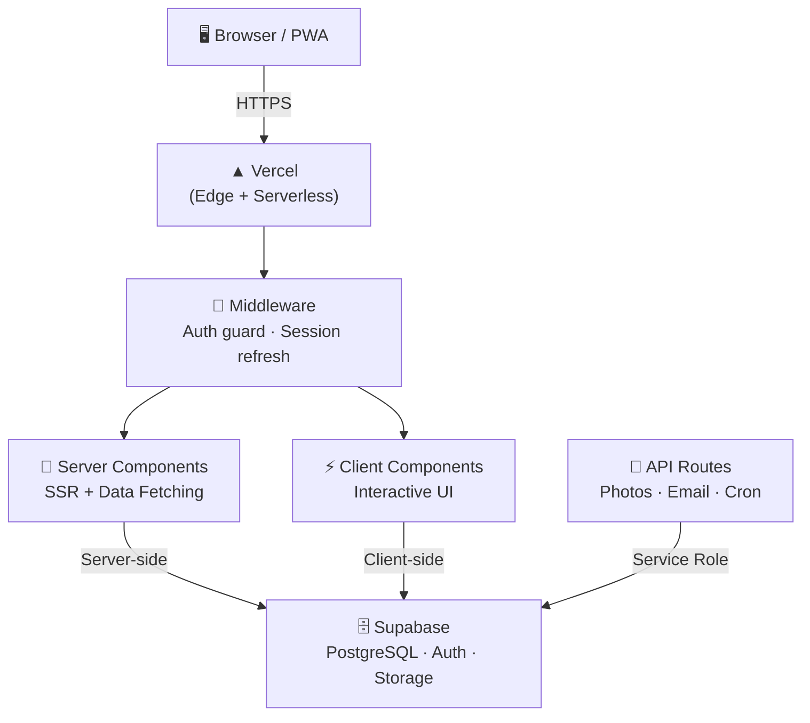
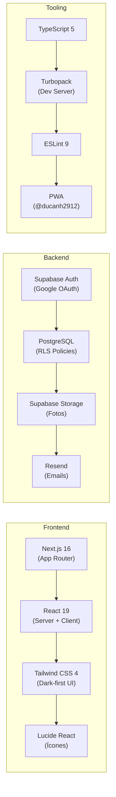
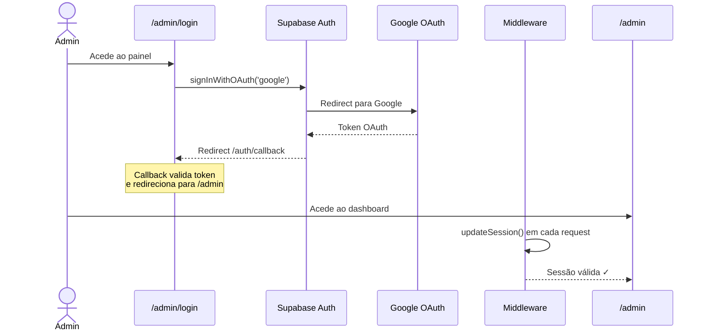
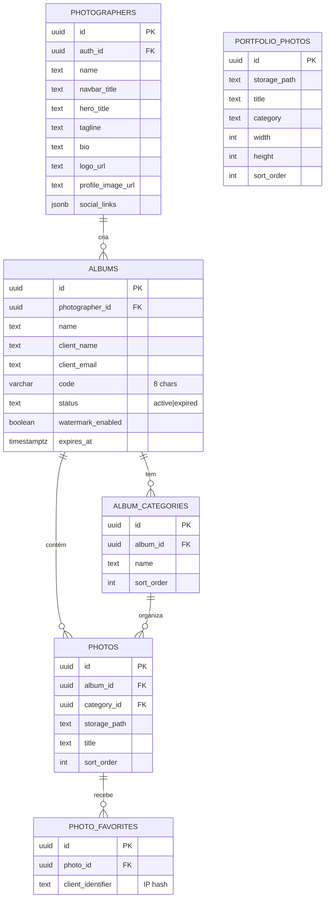
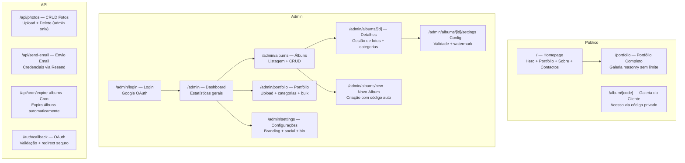
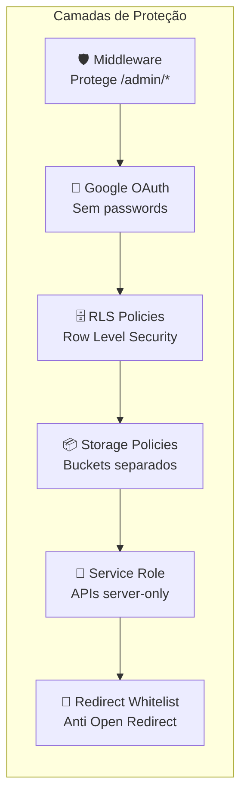
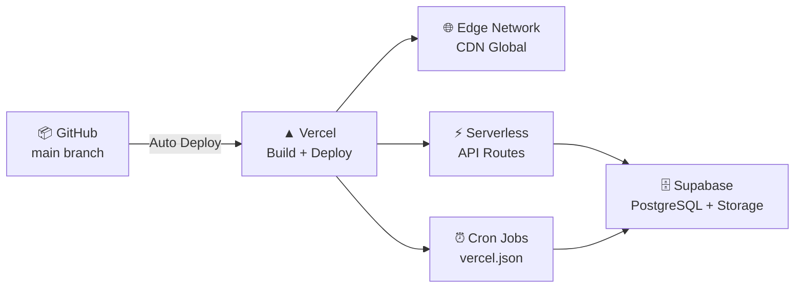

<div align="center">

# 📷 HL Photography

**Plataforma de Portfólio & Gestão de Álbuns Privados para Fotógrafos**

Aplicação web profissional que combina um portfólio público cinematográfico com um sistema privado de entrega de álbuns a clientes, com galeria interativa, favoritos e downloads em ZIP.

[](https://nextjs.org/)
[](https://react.dev/)
[](https://typescriptlang.org/)
[](https://supabase.com/)
[](https://vercel.com/)
[](https://tailwindcss.com/)
[](https://web.dev/progressive-web-apps/)

</div>

---

## 📋 Índice

- [Arquitetura do Sistema](#-arquitetura-do-sistema)
- [Stack Tecnológica](#-stack-tecnológica)
- [Funcionalidades — Fotógrafo (Admin)](#-funcionalidades--fotógrafo-admin)
- [Funcionalidades — Cliente](#-funcionalidades--cliente)
- [Fluxo de Autenticação](#-fluxo-de-autenticação)
- [Base de Dados](#-base-de-dados)
- [Mapa de Rotas](#️-mapa-de-rotas)
- [Segurança](#-segurança)
- [PWA & Performance](#-pwa--performance)
- [Deploy](#-deploy)
- [Configuração Local](#-configuração-local)

---

## 🏗 Arquitetura do Sistema

> Visão geral do fluxo da aplicação, desde o browser até à base de dados.



---

## 🛠 Stack Tecnológica



| Camada | Tecnologia | Propósito |
|--------|-----------|-----------|
| **Framework** | Next.js 16.1 (App Router + Turbopack) | SSR, SSG, API Routes, Middleware |
| **UI** | React 19, Tailwind CSS 4, Lucide | Interface cinematográfica dark-mode |
| **Tipografia** | Inter + Playfair Display + Great Vibes | UI / Display / Script fontes |
| **Database** | Supabase PostgreSQL + RLS | Dados + Políticas de segurança |
| **Auth** | Supabase Auth (Google OAuth) | Autenticação admin |
| **Storage** | Supabase Storage (2 buckets) | `portfolio` (público) + `albums` (privado) |
| **Email** | Resend | Envio de credenciais aos clientes |
| **Downloads** | JSZip + FileSaver.js | Download ZIP client-side |
| **PWA** | @ducanh2912/next-pwa | Instalável em iOS/Android |
| **Analytics** | @vercel/analytics | Métricas de utilização |
| **Deploy** | Vercel | Edge + Serverless + Cron Jobs |

---

## 🎯 Funcionalidades — Fotógrafo (Admin)

### 📊 Dashboard
- Resumo com álbuns ativos, total de fotos em álbuns e fotos no portfólio
- Saudação personalizada com nome do utilizador autenticado

### 🖼️ Gestão de Portfólio
- Upload múltiplo de fotos (até 10MB cada, JPEG/PNG/WebP)
- Categorização automática (Casamentos, Retratos, Editorial, etc.)
- Seleção em bulk para apagar ou reclassificar em massa
- Galeria masonry responsiva na homepage (limitada a 12 fotos)

### 📁 Álbuns de Clientes
- Criação de álbuns privados com código de acesso alfanumérico de 8 caracteres
- Gestão de subcategorias dentro de cada álbum
- Data de validade automática (3 meses por defeito, personalizável)
- Upload de fotos com organização por categorias
- Cron job automático para expirar álbuns antigos

### ✉️ Envio de Credenciais por Email
- Envio automático via Resend com template HTML profissional
- Email inclui: nome do cliente, link direto para a galeria e código de acesso
- Proteção: apenas admins autenticados podem enviar emails

### ⚙️ Configurações Globais
- Nome do estúdio, título no hero, tagline/slogan
- Texto na navbar (personalizável separadamente)
- Biografia completa para a secção "Sobre Mim"
- Upload de logótipo e foto de perfil
- Redes sociais: Instagram, Facebook, Email

---

## 👤 Funcionalidades — Cliente

### 🎨 Experiência Premium
- Layout totalmente dark-mode com estética cinematográfica
- Galeria masonry com hover effects e lazy loading
- Fotos apresentadas em máxima qualidade

### ❤️ Favoritos
- Sistema de "Heart" para marcar fotos favoritas
- Tab dedicada para ver apenas os favoritos
- Persistência por sessão/dispositivo (via IP hash)

### 🔍 Lightbox Full-Screen
- Visualização de fotos em ecrã completo
- Navegação por teclado (←/→) e swipe em mobile
- Transições suaves cinematográficas

### 📥 Downloads
- Download individual de fotos em qualidade original
- Download do álbum completo como ZIP (gerado client-side via JSZip)
- Sem limites de servidor — o ZIP é construído no browser

### 📱 PWA
- Instalável como app nativa em iOS e Android
- Ícones configurados (192x192 e 512x512)
- Modo standalone com tema preto

---

## 🔐 Fluxo de Autenticação



> [!TIP]
> O sistema usa **Google OAuth exclusivo** — sem passwords para gerir. O callback possui whitelist de redirects para prevenir ataques de Open Redirect.

---

## 🗄 Base de Dados



### Storage Buckets

| Bucket | Acesso | Conteúdo |
|--------|--------|----------|
| `portfolio` | 🌍 Público | Fotos do portfólio (homepage) |
| `albums` | 🔒 Privado | Fotos de clientes (acesso via código) |

---

## 🗺️ Mapa de Rotas



---

## 🔒 Segurança



| Mecanismo | Implementação |
|-----------|--------------|
| **Middleware** | Protege todas as rotas `/admin/*` — redireciona para login se não autenticado |
| **Google OAuth** | Autenticação via Supabase Auth — sem formulários de password |
| **Row Level Security** | Políticas Supabase garantem que clientes só acedem fotos com o código correto |
| **Storage Policies** | Bucket `portfolio` público, bucket `albums` requer lógica de acesso |
| **Service Role** | API Routes usam `SUPABASE_SERVICE_ROLE_KEY` apenas server-side |
| **Redirect Whitelist** | Callback OAuth valida paths contra whitelist: `/admin`, `/admin/login`, `/` |
| **Códigos Alfanuméricos** | Caracteres confusos removidos (O/0/I/1) — 8 chars uppercase |

---

## 📱 PWA & Performance

| Funcionalidade | Detalhe |
|---------------|---------|
| **Instalável** | Manifesto PWA com ícones 192x192 e 512x512 |
| **Standalone** | Abre como app nativa sem barra do browser |
| **Tema** | Background e theme color `#000000` |
| **Turbopack** | Dev server com HMR ultra-rápido |
| **Image Optimization** | Next.js Image com remote patterns Supabase + Unsplash |
| **Lazy Loading** | Fotos carregadas sob demanda na galeria masonry |
| **Client-side ZIP** | JSZip gera downloads sem sobrecarregar o servidor |
| **Analytics** | @vercel/analytics integrado |

---

## 🚀 Deploy

> Optimizado para deploy no **Vercel** com suporte integrado para serverless functions, Edge caching e cron jobs automatizados.



### Variáveis de Ambiente

```env
# Supabase
NEXT_PUBLIC_SUPABASE_URL=https://xxxxx.supabase.co
NEXT_PUBLIC_SUPABASE_ANON_KEY=xxxxx
SUPABASE_SERVICE_ROLE_KEY=xxxxx

# Email
RESEND_API_KEY=re_xxxxx
```

---

## ⚙️ Configuração Local

```bash
# 1. Clonar o repositório
git clone https://github.com/Rafa200200/photography-app.git
cd photography-app

# 2. Instalar dependências
npm install

# 3. Configurar variáveis de ambiente
cp .env.example .env.local
# Preencher com as credenciais Supabase e Resend

# 4. Iniciar em modo desenvolvimento
npm run dev
```

> [!TIP]
> O Turbopack está ativo por defeito no modo desenvolvimento, proporcionando HMR praticamente instantâneo. A PWA é desativada automaticamente em dev para evitar conflitos.

---

## 🧩 Estrutura do Projeto

```
src/
├── app/
│   ├── page.tsx                    # Homepage (SSR → HomeClient)
│   ├── HomeClient.tsx              # Client wrapper com Navbar + Hero + Galeria + Footer
│   ├── layout.tsx                  # Root Layout (fontes + metadata dinâmica)
│   ├── manifest.ts                 # PWA Manifest
│   ├── globals.css                 # Tailwind + animações cinematográficas
│   ├── portfolio/                  # Portfólio completo (pág. dedicada)
│   ├── album/[code]/               # Galeria privada do cliente
│   ├── auth/callback/              # OAuth callback handler
│   ├── api/
│   │   ├── photos/                 # CRUD de fotos (admin only)
│   │   ├── send-email/             # Envio de credenciais via Resend
│   │   └── cron/expire-albums/     # Cron job de expiração
│   └── admin/
│       ├── layout.tsx              # Admin layout com sidebar
│       ├── page.tsx                # Dashboard com estatísticas
│       ├── login/                  # Login com Google OAuth
│       ├── albums/                 # CRUD de álbuns + detalhes + settings
│       ├── portfolio/              # Gestão do portfólio público
│       └── settings/               # Configurações globais
├── components/
│   ├── home/                       # Hero, AboutSection, ContactSection, ClientAccessModal
│   ├── gallery/                    # MasonryGrid, Lightbox
│   ├── layout/                     # Navbar, Footer, AdminSidebar
│   └── ui/                         # SafeImage, componentes reutilizáveis
└── lib/
    ├── constants.ts                # Config fallback + placeholder photos
    ├── utils.ts                    # generateAlbumCode, formatBytes
    └── supabase/
        ├── client.ts               # Supabase browser client
        ├── server.ts               # Supabase server client
        ├── middleware.ts            # Session refresh middleware
        └── queries.ts              # getGlobalConfig, getPortfolioPhotos
```

---

## 🎨 Design System

| Elemento | Valor |
|----------|-------|
| **Tema** | Dark-first (`html.dark`) |
| **Background** | `#09090b` (zinc-950) |
| **Accent** | Configurável via CSS variables |
| **Fonte Display** | Playfair Display (títulos elegantes) |
| **Fonte Body** | Inter (UI clean) |
| **Fonte Script** | Great Vibes (assinatura do fotógrafo) |
| **Animações** | fadeInUp, fadeIn, scaleIn, slideDown — timings cinematográficos |
| **Scrollbar** | Minimalista 4px, transparente |
| **Glass Effect** | `backdrop-blur` na navbar ao scroll |

---

<div align="center">

**Desenvolvido com** ❤️ **usando Next.js 16, React 19, Supabase e Tailwind CSS 4**

</div>
